# GlowUp - Mental Health Awareness Website - Project 1

## Description

GlowUp is a responsive website built with HTML, CSS, and Bootstrap designed to inform and promote
mental health awareness. It offers educational content, motivational messages, and practical
self-care tips to encourage emotional well-being and help users develop healthier habits in a simple
and accessible way.

## Responsive Design

This project was built following a mobile‑first approach, ensuring that the website delivers an
optimal experience on all screen sizes. 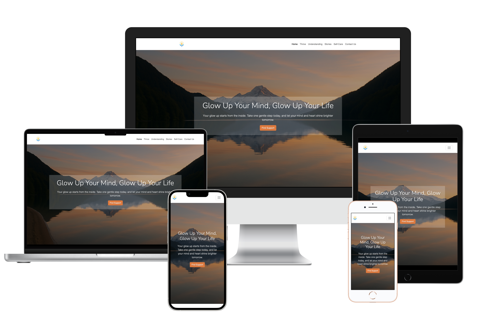

### Mobile‑First:

The design was first created for smartphones to prioritize usability and performance on smaller
screens.

### Responsive Layout:

Using Bootstrap’s grid system combined with custom CSS media queries, the layout automatically
adapts to:

-   Mobile devices (small screens )
-   Tablets (medium screens)
-   Laptops (large screens)
-   Extra‑large desktop monitors

## Wireframes

### Home-mobile and Home-Tablet

  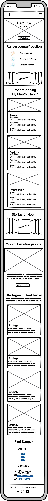
  &nbsp;&nbsp;&nbsp;
  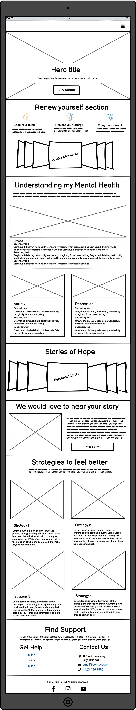

### Home-Desktop

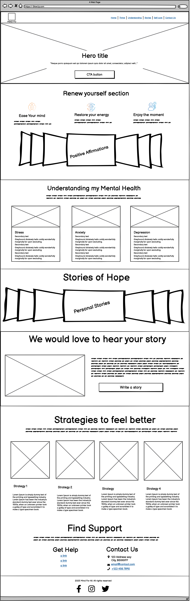

### Success-mobile-tablet and Success-desktop

  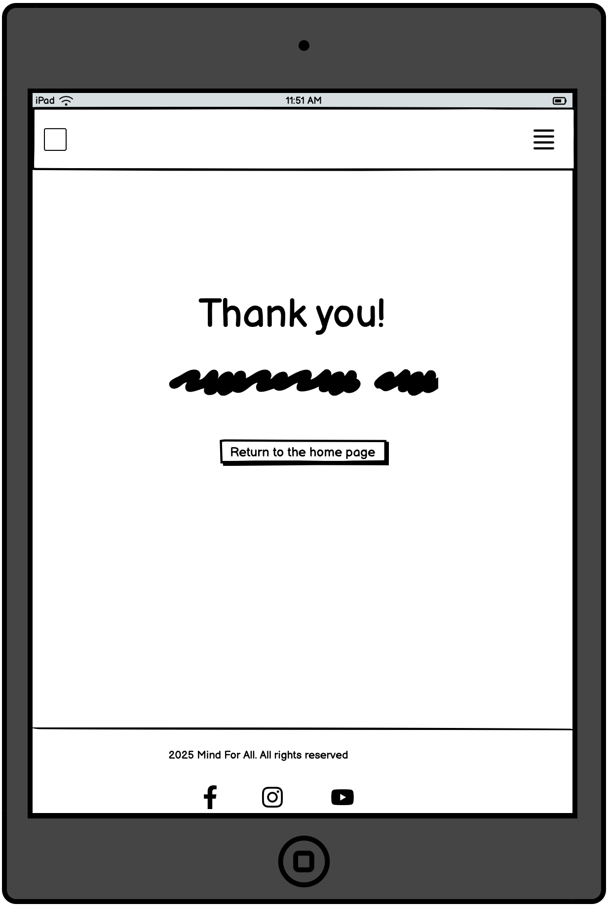
  &nbsp;&nbsp;&nbsp;
  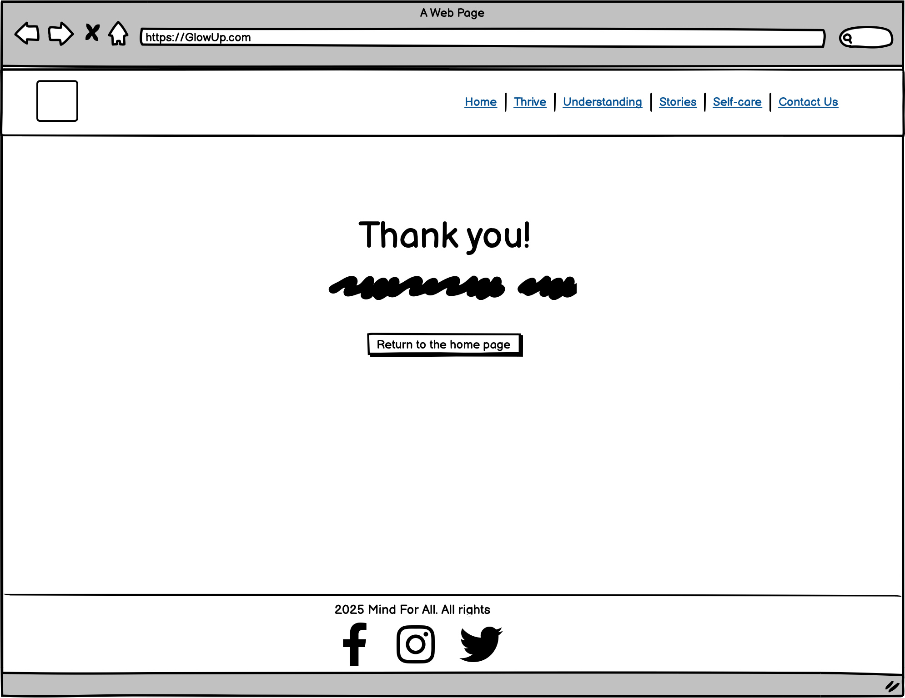

### User Stories

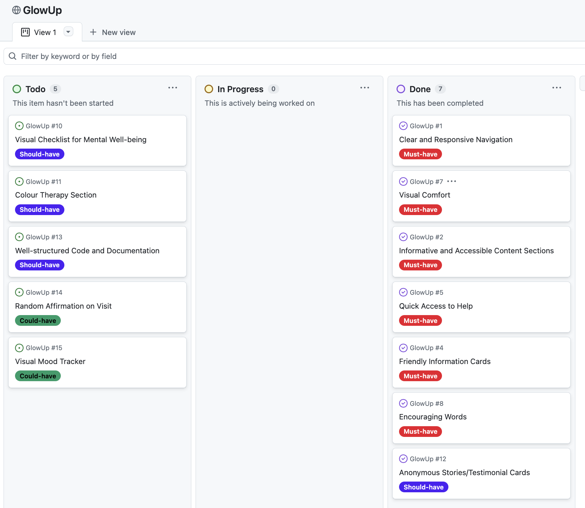

## Use of Artificial Intelligence in the GlowUp Project

Throughout the development of the GlowUp project, I leveraged various artificial intelligence tools
to optimize different stages of the work—from image creation to coding and information gathering.
Below is a detailed explanation of how I used each tool and its specific role:

### Image Generation

To create visual elements for the project, I used AI-powered tools that allowed me to generate
attractive and customized images without manual design work:

-   ChatGPT: Used for generating ideas and descriptions for images that I later created using other
    platforms.
-   Microsoft Creative: A tool for quickly producing professional-style images based on text
    prompts.
-   Canva: A design platform enhanced with AI features, where I refined and polished generated
    images.
-   T3 Chat: Used to explore visual concepts and receive creative suggestions.

### Text Creation

For writing content, descriptive texts, and explanations throughout the project, I employed:

-   Perplexity: My primary tool for obtaining quick and accurate answers to base my writing on.
-   ChatGPT: Used to polish and expand the text, ensuring clarity and coherence.

### Code Generation and Debugging

AI played a key role in accelerating coding and fixing errors during development:

-   GitHub Copilot: Mainly used to generate code blocks, provide smart suggestions, autocomplete
    functions, and help detect and fix bugs.
-   ChatGPT: Provided additional support for complex doubts and detailed explanations about code
    snippets or technical concepts.
-   Perplexity: Utilized to quickly find solutions to programming problems and better understand
    functionalities or libraries.

### Information Research

For researching relevant information throughout the project, especially for technical and design
topics, I mainly used:

-   Perplexity: As my go-to tool for precise and up-to-date answers that facilitated decision-making
    and implementation.

### Debugging and Optimization

During the testing and improvement phases:

-   GitHub Copilot: Was the primary tool for identifying errors and suggesting efficient code
    corrections.
-   ChatGPT: Used occasionally for detailed problem-solving and alternative solutions.

## Visual Design

### Colors & Typography

| Name                  | Hex       | Preview    |
| --------------------- | --------- | ---------- |
| Body Color            | `#11416f` | ![#11416f] |
| Primary Color         | `#2c5c88` | ![#2c5c88] |
| Secondary Color       | `#6fa8dc` | ![#6fa8dc] |
| Highlight Color       | `#ef732b` | ![#ef732b] |
| Highlight Color Light | `#f4ede4` | ![#f4ede4] |
| Background Color      | `#fadfc6` | ![#fadfc6] |
| White Color           | `#ffffff` | ![#ffffff] |

### Typography

For this project, I used the Nunito Sans font from Google Fonts.

### Images

Images play a vital role in the design and impact of this Mental Health Awareness project.
Significant time and effort were invested in generating and selecting visuals using AI tools to
ensure they effectively support the project’s message.

Carefully chosen images enhance the emotional connection and create a more engaging and meaningful
user experience.

# GlowUp website sections

## Navigation

The navigation bar is designed to offer a clear and intuitive user experience. It features an
AI-generated logo that serves as a link to the top of the page or the homepage, making it easy for
users to return to the start from any section. The main menu includes the following navigation
links: • Home • Thrive • Understanding • Stories • Self-care • Contact Us Each of these links takes
users directly to its respective section within the page, ensuring smooth and fast navigation. On
mobile devices and tablets, the navigation adapts by collapsing into a hamburger menu. This approach
improves accessibility and optimizes screen space on smaller displays—the menu can be expanded by
tapping the icon. On screens larger than 992px (desktop devices), the navigation bar expands,
displaying all links directly at the top of the page. This responsive structure ensures consistent
and efficient navigation across all devices.

## Hero Section.

The Hero section serves as the visual and emotional introduction to the page. It features a main
heading inspired by the name of the project, visually reinforcing the purpose of the site: spreading
mental health awareness. Beneath the heading, there’s a short, uplifting message intended to inspire
hope and encourage visitors to explore further. To guide user engagement, the section includes a
Call to Action (CTA) button that directs users to the contact section, in case they are looking for
help or assistance.

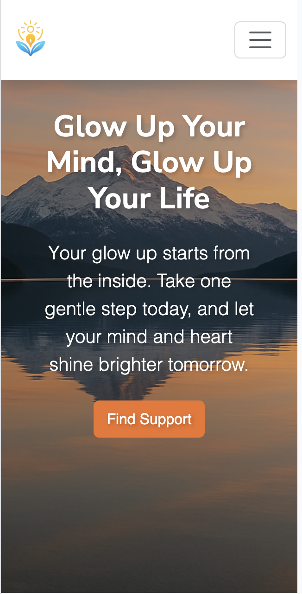
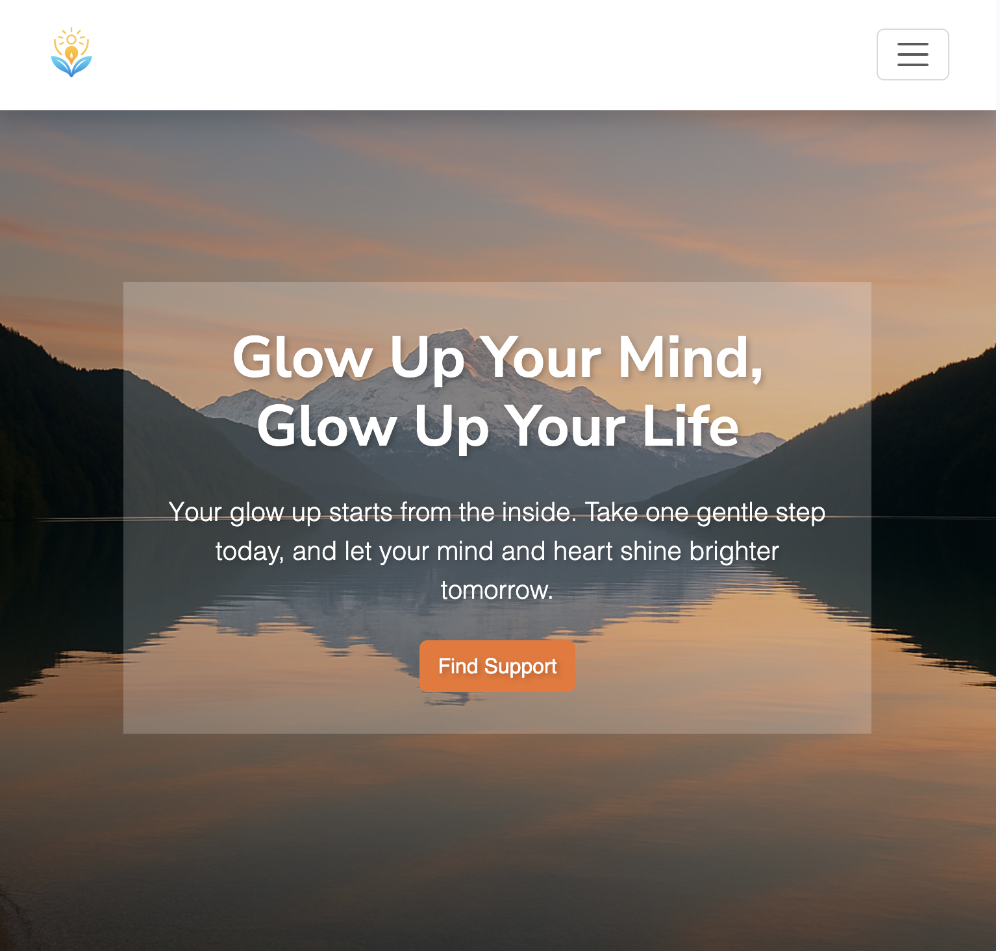
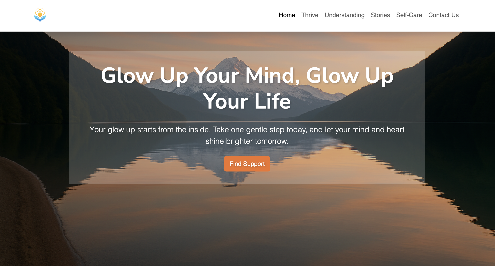

## Thrive Section

Thrive offers uplifting, positive messages to encourage and support everyone on their mental health
journey. You are not alone here.

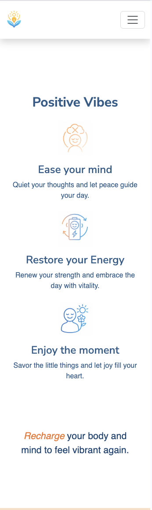

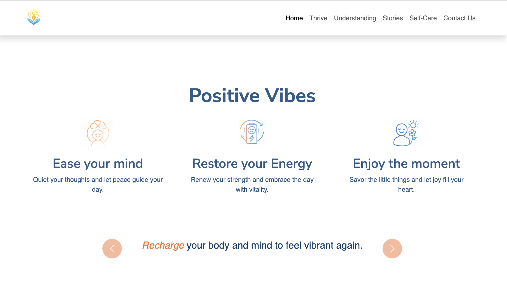

## Understanding Section

Understanding helps visitors identify stress, anxiety, and depression, offering practical tips to
cope and promoting self-awareness for improved mental well-being.

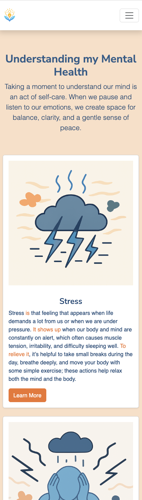
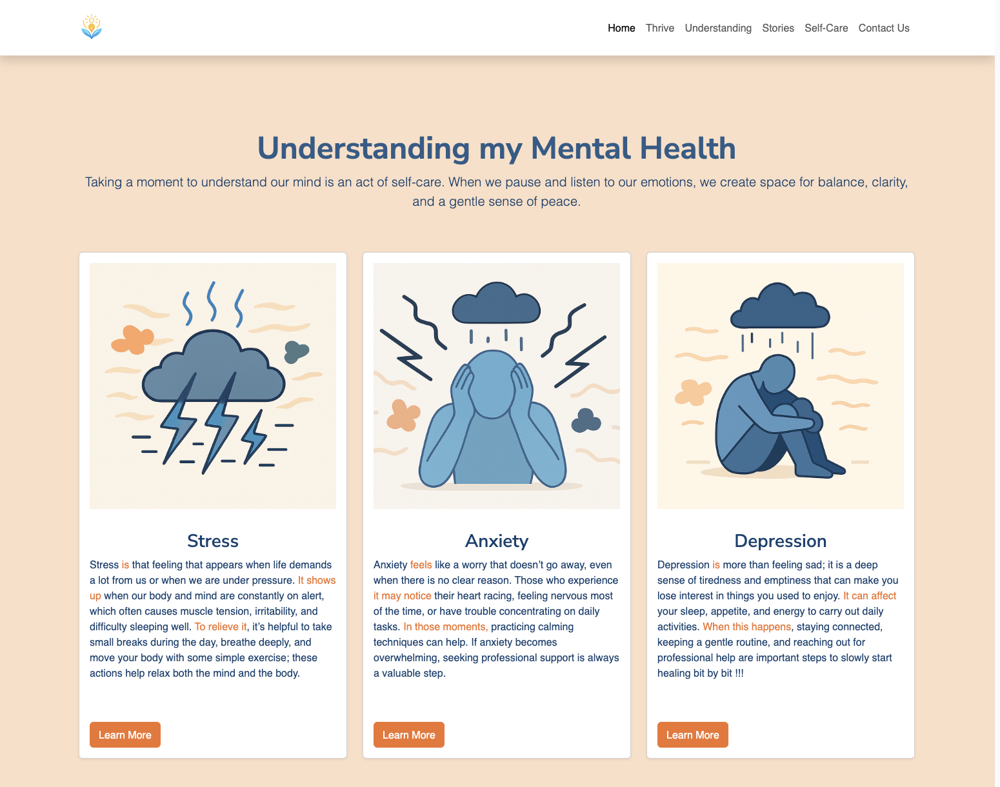

## Stories Section

## Validation

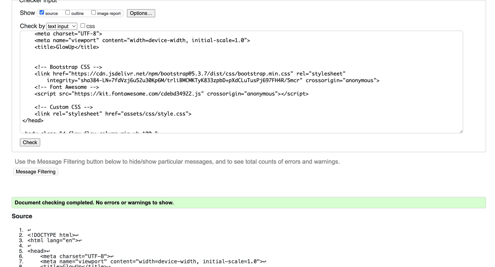

## Lighthouse

Lighthouse was used to test the performance, accessibility, best practices, and SEO of the website.
The results are as follows: 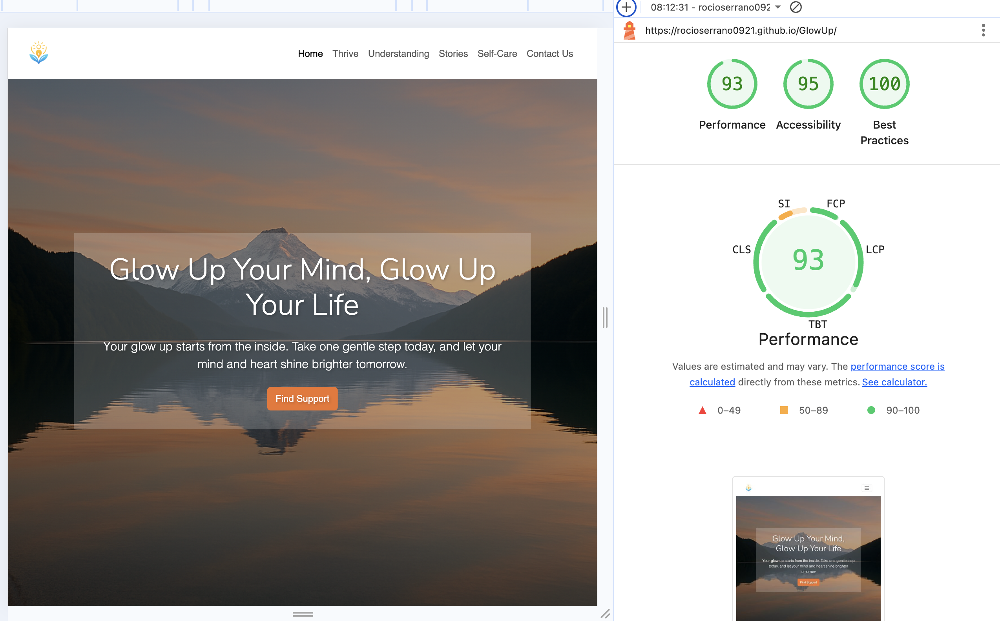
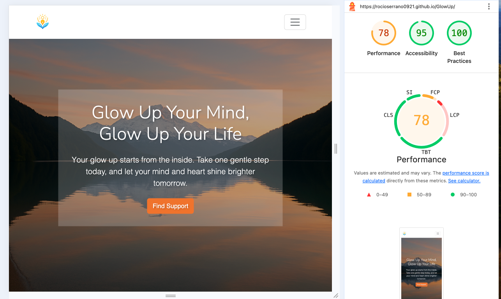

## Deployment

-   In the GitHub repository, navigate to the Settings tab.
-   Scroll down until GitHub Pages is found.
-   From the source section drop-down menu, select the main branch.
-   Once the main branch has been selected, hit the save button.
-   Finally, when the page is refreshed, a detailed ribbon display will indicate the successful
    deployment.
